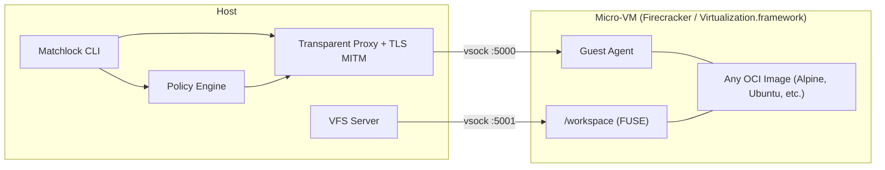

# Matchlock

> **Experimental:** This project is still in active development and subject to breaking changes.

Matchlock is a CLI tool for running AI agents in ephemeral microVMs - with network allowlisting, secret injection via MITM proxy, and VM-level isolation. Your secrets never enter the VM.

## Why Matchlock?

AI agents need to run code, but giving them unrestricted access to your machine is a risk. Matchlock lets you hand an agent a full Linux environment that boots in under a second - isolated and disposable.

When you pass `--allow-host` or `--secret`, Matchlock seals the network - only traffic to explicitly allowed hosts gets through, and everything else is blocked. When your agent calls an API the real credentials are injected in-flight by the host. The sandbox only ever sees a placeholder. Even if the agent is tricked into running something malicious your keys don't leak and there's nowhere for data to go. Inside the agent gets a full Linux environment to do whatever it needs. It can install packages and write files and make a mess. Outside your machine doesn't feel a thing. Volume overlay mounts are isolated snapshots that vanish when you're done. Same CLI and same behaviour whether you're on a Linux server or a MacBook.

## Quick Start

### System Requirements

- **Linux** with KVM support
- **macOS** on Apple Silicon

### Install

```bash
brew tap jingkaihe/essentials
brew install matchlock
```

### Usage

```bash
# Basic
matchlock run --image alpine:latest cat /etc/os-release
matchlock run --image alpine:latest -it sh
matchlock run --image alpine:latest --no-network -- sh -lc 'echo offline'

# Network allowlist
matchlock run --image python:3.12-alpine \
  --allow-host "api.openai.com" python agent.py

# Keep interception enabled even with an empty allowlist,
# so hosts can be added/removed at runtime.
matchlock run --image alpine:latest --rm=false --network-intercept
matchlock allow-list add <vm-id> api.openai.com,api.anthropic.com
matchlock allow-list delete <vm-id> api.openai.com

# Secret injection (never enters the VM)
export ANTHROPIC_API_KEY=sk-xxx
matchlock run --image python:3.12-alpine \
  --secret ANTHROPIC_API_KEY@api.anthropic.com python call_api.py

# Long-lived sandboxes
matchlock run --image alpine:latest --rm=false   # prints VM ID
matchlock exec vm-abc12345 -it sh                # attach to it
matchlock port-forward vm-abc12345 8080:8080     # forward host:8080 -> guest:8080

# Publish ports at startup
matchlock run --image alpine:latest --rm=false -p 8080:8080

# Lifecycle
matchlock list | kill | rm | prune

# Build from Dockerfile (uses BuildKit-in-VM)
matchlock build -f Dockerfile -t myapp:latest .

# Pre-build rootfs from registry image (caches for faster startup)
matchlock build alpine:latest

# Image management
matchlock image ls                                           # List all images
matchlock image rm myapp:latest                              # Remove a local image
docker save myapp:latest | matchlock image import myapp:latest  # Import from tarball
```

## SDK

Matchlock ships Go, Python, and TypeScript SDKs for embedding sandboxes directly in your application. You can launch VMs, execute commands, stream output, and manage files programmatically.

**Go**

```go
package main

import (
	"context"
	"fmt"
	"os"

	"github.com/jingkaihe/matchlock/pkg/sdk"
)

func main() {
	ctx := context.Background()

	client, err := sdk.NewClient(sdk.DefaultConfig())
	if err != nil {
		panic(err)
	}
	defer client.Close(0)
	defer client.Remove()

	sandbox := sdk.New("alpine:latest").
		AllowHost("dl-cdn.alpinelinux.org", "api.anthropic.com").
		AddSecret("ANTHROPIC_API_KEY", os.Getenv("ANTHROPIC_API_KEY"), "api.anthropic.com")
	if _, err := client.Launch(sandbox); err != nil {
		panic(err)
	}
	if _, err := client.Exec(ctx, "apk add --no-cache curl"); err != nil {
		panic(err)
	}
	// The VM only ever sees a placeholder - the real key never enters the sandbox
	result, err := client.Exec(ctx, "echo $ANTHROPIC_API_KEY")
	if err != nil {
		panic(err)
	}
	fmt.Print(result.Stdout) // prints "SANDBOX_SECRET_a1b2c3d4..."

	curlCmd := `curl -s --no-buffer https://api.anthropic.com/v1/messages \
  -H "content-type: application/json" \
  -H "x-api-key: $ANTHROPIC_API_KEY" \
  -H "anthropic-version: 2023-06-01" \
  -d '{"model":"claude-haiku-4-5-20251001","max_tokens":1024,"stream":true,
       "messages":[{"role":"user","content":"Explain TCP to me"}]}'`
	if _, err := client.ExecStream(ctx, curlCmd, os.Stdout, os.Stderr); err != nil {
		panic(err)
	}
}
```

Go SDK private-IP behavior (`10/8`, `172.16/12`, `192.168/16`):

- Default (unset): private IPs are blocked whenever a network config is sent.
- Explicit block: call `.WithBlockPrivateIPs(true)` (or `.BlockPrivateIPs()`).
- Explicit allow: call `.AllowPrivateIPs()` or `.WithBlockPrivateIPs(false)`.

```go
sandbox := sdk.New("alpine:latest").
	AllowHost("api.openai.com").
	AddHost("api.internal", "10.0.0.10").
	WithNetworkMTU(1200).
	AllowPrivateIPs() // explicit override: block_private_ips=false

// SDK network interception (request/response mutation, body shaping, SSE data-line transform)
sandbox = sandbox.WithNetworkInterception(&sdk.NetworkInterceptionConfig{
	Rules: []sdk.NetworkHookRule{
		{
			Phase:      sdk.NetworkHookPhaseBefore,
			Action:     sdk.NetworkHookActionMutate,
			Hosts:      []string{"api.openai.com"},
			SetHeaders: map[string]string{"X-Trace-Id": "trace-123"},
		},
		{
			Phase:  sdk.NetworkHookPhaseAfter,
			Action: sdk.NetworkHookActionMutate,
			Hosts:  []string{"api.openai.com"},
			BodyReplacements: []sdk.NetworkBodyTransform{
				{Find: "internal-id", Replace: "redacted"},
			},
		},
	},
})
```

If you use `client.Create(...)` directly (without the builder), set:
- `BlockPrivateIPsSet: true`
- `BlockPrivateIPs: false` (or `true`)

For fully offline sandboxes (no guest NIC / no egress), use:
- CLI: `--no-network`
- Go SDK builder: `.WithNoNetwork()`
- Python SDK builder: `.with_no_network()`
- TypeScript SDK builder: `.withNoNetwork()`

**Python** ([PyPI](https://pypi.org/project/matchlock/))

```bash
pip install matchlock
# or
uv add matchlock
```

```python
import os
import sys

from matchlock import Client, Sandbox

sandbox = (
    Sandbox("python:3.12-alpine")
    .allow_host(
        "dl-cdn.alpinelinux.org",
        "files.pythonhosted.org", "pypi.org",
        "astral.sh", "github.com", "objects.githubusercontent.com",
        "api.anthropic.com",
    )
    .add_secret(
        "ANTHROPIC_API_KEY", os.environ["ANTHROPIC_API_KEY"], "api.anthropic.com"
    )
)

SCRIPT = """\
# /// script
# requires-python = ">=3.12"
# dependencies = ["anthropic"]
# ///
import anthropic, os

client = anthropic.Anthropic(api_key=os.environ["ANTHROPIC_API_KEY"])
with client.messages.stream(
    model="claude-haiku-4-5-20251001",
    max_tokens=1024,
    messages=[{"role": "user", "content": "Explain TCP/IP."}],
) as stream:
    for text in stream.text_stream:
        print(text, end="", flush=True)
print()
"""

with Client() as client:
    client.launch(sandbox)
    client.exec("pip install --quiet uv")
    client.write_file("/workspace/ask.py", SCRIPT)
    client.exec_stream("uv run /workspace/ask.py", stdout=sys.stdout, stderr=sys.stderr)

client.remove()
```

**TypeScript**

```bash
npm install matchlock-sdk
```

```ts
import { Client, Sandbox } from "matchlock-sdk";

const SCRIPT = `import Anthropic from "@anthropic-ai/sdk";

const anthropic = new Anthropic({
  apiKey: process.env.ANTHROPIC_API_KEY,
});

const stream = anthropic.messages
  .stream({
    model: "claude-haiku-4-5-20251001",
    max_tokens: 1024,
    messages: [{ role: "user", content: "Explain TCP/IP." }],
  })
  .on("text", (text) => {
    process.stdout.write(text);
  });

await stream.finalMessage();
process.stdout.write("\\n");
`;

const client = new Client();
try {
  const sandbox = new Sandbox("node:22-alpine")
    .allowHost("registry.npmjs.org", "*.npmjs.org", "api.anthropic.com")
    .addSecret("ANTHROPIC_API_KEY", process.env.ANTHROPIC_API_KEY ?? "", "api.anthropic.com");

  await client.launch(sandbox);
  await client.exec(
    "npm init -y >/dev/null 2>&1 && npm install --quiet --no-bin-links @anthropic-ai/sdk",
    { workingDir: "/workspace" },
  );
  await client.writeFile("/workspace/ask.mjs", SCRIPT);
  await client.execStream("node ask.mjs", {
    workingDir: "/workspace",
    stdout: process.stdout,
    stderr: process.stderr,
  });
} finally {
  await client.close();
  await client.remove();
}
```

See full examples in:
- [`examples/go/basic/main.go`](examples/go/basic/main.go)
- [`examples/go/exec_modes/main.go`](examples/go/exec_modes/main.go)
- [`examples/go/exec_modes/README.md`](examples/go/exec_modes/README.md)
- [`examples/go/network_interception/main.go`](examples/go/network_interception/main.go)
- [`examples/go/network_interception/README.md`](examples/go/network_interception/README.md)
- [`examples/go/vfs_hooks/main.go`](examples/go/vfs_hooks/main.go)
- [`examples/python/basic/main.py`](examples/python/basic/main.py)
- [`examples/python/network_interception/main.py`](examples/python/network_interception/main.py)
- [`examples/python/network_interception/README.md`](examples/python/network_interception/README.md)
- [`examples/python/vfs_hooks/main.py`](examples/python/vfs_hooks/main.py)
- [`examples/typescript/basic/main.ts`](examples/typescript/basic/main.ts)
- [`examples/typescript/network_interception/main.ts`](examples/typescript/network_interception/main.ts)
- [`examples/typescript/network_interception/README.md`](examples/typescript/network_interception/README.md)

## Architecture



### Network Modes

| Platform | Mode | Mechanism |
|----------|------|-----------|
| Linux | Transparent proxy | nftables DNAT on ports 80/443 |
| macOS | NAT (default) | Virtualization.framework built-in NAT |
| macOS | Interception (with `--allow-host`/`--secret`) | gVisor userspace TCP/IP at L4 |

## Docs

- [Lifecycle and Cleanup Runbook](docs/lifecycle.md)
- [Network Interception](docs/network-interception.md)
- [VFS Interception](docs/vfs-interception.md)
- [Developer Reference](AGENTS.md)

## License

MIT
