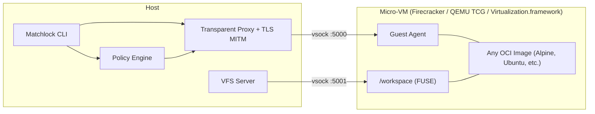

# Matchlock

> **Experimental:** This project is still in active development and subject to breaking changes.

Matchlock is a CLI tool for running AI agents in ephemeral microVMs - with network allowlisting, secret injection via MITM proxy, and VM-level isolation. Your secrets never enter the VM.

## Why Matchlock?

AI agents need to run code, but giving them unrestricted access to your machine is a risk. Matchlock lets you hand an agent a full Linux environment that boots in under a second - isolated and disposable.

When you pass `--allow-host` or `--secret`, Matchlock seals the network - only traffic to explicitly allowed hosts gets through, and everything else is blocked. When your agent calls an API the real credentials are injected in-flight by the host. The sandbox only ever sees a placeholder. Even if the agent is tricked into running something malicious your keys don't leak and there's nowhere for data to go. Inside the agent gets a full Linux environment to do whatever it needs. It can install packages and write files and make a mess. Outside your machine doesn't feel a thing. Volume overlay mounts are isolated snapshots that vanish when you're done. Same CLI and same behaviour whether you're on a Linux server or a MacBook.

## Quick Start

### System Requirements

- **Linux** — a KVM-capable host (Firecracker) or, as a fallback, QEMU TCG (Software) when `/dev/kvm` is unavailable
- **macOS** on Apple Silicon

Matchlock selects a VM backend automatically. On Linux it prefers the KVM-accelerated **Firecracker** backend and falls back to the **QEMU TCG** (software-emulation) backend when `/dev/kvm` is absent or unusable. You can force a choice with `MATCHLOCK_BACKEND=firecracker|qemu`. QEMU TCG needs no KVM — it emulates the CPU — but still requires `/dev/vhost-vsock` access (your user must be in the `kvm` group; re-login after `sudo matchlock setup user <name>`). For details see [`docs/linux-packaging.md`](./docs/linux-packaging.md).

### Install

See [`docs/install.md`](./docs/install.md) for full installation details.

**Quick Installation**

The script below detect OS, and install matchlock using Homebrew on Macos, and rpm/deb on Debian/RHEL flavourd Linux Distros

```bash
curl -fsSL https://raw.githubusercontent.com/jingkaihe/matchlock/main/scripts/install.sh | bash

# Or install a specific release
curl -fsSL https://raw.githubusercontent.com/jingkaihe/matchlock/main/scripts/install.sh | bash -s -- --version 0.2.4
```

**Homebrew**

Homebrew based installation is supported on both macOS and Linux:

```bash
brew tap jingkaihe/essentials
brew install matchlock
```

**Debian / Ubuntu (.deb)**

```bash
sudo dpkg -i ./matchlock_<version>_linux_amd64.deb
sudo apt-get install -f
matchlock diagnose
```

**Fedora / RHEL / CentOS Stream (.rpm)**

```bash
sudo dnf install ./matchlock_<version>_linux_amd64.rpm
matchlock diagnose
```

If `matchlock diagnose` reports missing host setup, run:

```bash
sudo matchlock setup linux
```

To enroll a specific user explicitly, run:

```bash
sudo matchlock setup user <name>
```

### Usage

```bash
# Basic
matchlock run --image alpine:latest cat /etc/os-release
matchlock run --image alpine:latest -it sh
matchlock run --image alpine:latest --no-network -- sh -lc 'echo offline'

# Network allowlist
matchlock run --image python:3.12-alpine \
  --allow-host "api.openai.com" python agent.py

# Keep interception enabled even with an empty allowlist,
# so hosts can be added/removed at runtime.
matchlock run --image alpine:latest --rm=false --network-intercept
matchlock allow-list add <vm-id> api.openai.com,api.anthropic.com
matchlock allow-list delete <vm-id> api.openai.com

# Secret injection (never enters the VM)
export ANTHROPIC_API_KEY=sk-xxx
matchlock run --image python:3.12-alpine \
  --secret ANTHROPIC_API_KEY@api.anthropic.com python call_api.py

# Long-lived sandboxes
matchlock run --image alpine:latest --rm=false   # prints VM ID
matchlock run --image nginx:latest -d             # same as above, detached
matchlock exec vm-abc12345 -it sh                # attach to it
matchlock port-forward vm-abc12345 8080:8080     # forward host:8080 -> guest:8080

# Publish ports at startup
matchlock run --image alpine:latest --rm=false -p 8080:8080

# Lifecycle
matchlock list | kill | rm | prune

# Build from Dockerfile (uses BuildKit-in-VM)
matchlock build -f Dockerfile -t myapp:latest .

# Pre-build rootfs from registry image (caches for faster startup)
matchlock build alpine:latest

# Image management
matchlock image ls                                           # List all images
matchlock image rm myapp:latest                              # Remove a local image
docker save myapp:latest | matchlock image import myapp:latest  # Import from tarball
```

## SDK

Matchlock ships Go, Python, and TypeScript SDKs for embedding sandboxes directly in your application. You can launch VMs, execute commands, stream output, and manage files programmatically.

**Go**

```go
package main

import (
	"context"
	"fmt"
	"os"

	"github.com/jingkaihe/matchlock/pkg/sdk"
)

func main() {
	ctx := context.Background()

	client, err := sdk.NewClient(sdk.DefaultConfig())
	if err != nil {
		panic(err)
	}
	defer client.Close(0)
	defer client.Remove()

	sandbox := sdk.New("alpine:latest").
		AllowHost("dl-cdn.alpinelinux.org", "api.anthropic.com").
		AddSecret("ANTHROPIC_API_KEY", os.Getenv("ANTHROPIC_API_KEY"), "api.anthropic.com")
	if _, err := client.Launch(sandbox); err != nil {
		panic(err)
	}
	if _, err := client.Exec(ctx, "apk add --no-cache curl"); err != nil {
		panic(err)
	}
	// The VM only ever sees a placeholder - the real key never enters the sandbox
	result, err := client.Exec(ctx, "echo $ANTHROPIC_API_KEY")
	if err != nil {
		panic(err)
	}
	fmt.Print(result.Stdout) // prints "SANDBOX_SECRET_a1b2c3d4..."

	curlCmd := `curl -s --no-buffer https://api.anthropic.com/v1/messages \
  -H "content-type: application/json" \
  -H "x-api-key: $ANTHROPIC_API_KEY" \
  -H "anthropic-version: 2023-06-01" \
  -d '{"model":"claude-haiku-4-5-20251001","max_tokens":1024,"stream":true,
       "messages":[{"role":"user","content":"Explain TCP to me"}]}'`
	if _, err := client.ExecStream(ctx, curlCmd, os.Stdout, os.Stderr); err != nil {
		panic(err)
	}
}
```

Go SDK private-IP behavior:

With `block_private_ips` enabled, a destination is denied when any address it
targets (or resolves to) falls in one of these ranges:

- IPv4: `10.0.0.0/8`, `172.16.0.0/12`, `192.168.0.0/16`, `127.0.0.0/8`,
  `169.254.0.0/16` (link-local), `100.64.0.0/10` (CGNAT / Tailscale-style)
- IPv6: `::1/128`, `fc00::/7` (unique local), `fe80::/10` (link-local),
  `200::/7` (Yggdrasil overlay)
- IPv4-mapped IPv6 (`::ffff:0:0/96`): the embedded IPv4 address is checked
  against the IPv4 ranges above, so `::ffff:192.168.1.1` is private while
  `::ffff:8.8.8.8` is public. The mapped prefix is handled explicitly rather
  than added as a CIDR entry, because `net.ParseCIDR("::ffff:0:0/96")`
  normalizes to `0.0.0.0/0` and would otherwise mark every IPv4 address private.

The same policy decides IPv6 destinations. Under interception every guest IPv6
connection is redirected into the same proxy, so an address in `::1/128`,
`fc00::/7` (unique local), `fe80::/10` (link-local) or `200::/7` (Yggdrasil
overlay) is refused unless an `allow_private` entry exempts it. IPv6 is not a
side channel around the network policy — see [IPv6 Interception](#ipv6-interception).

Reach specific private endpoints without disabling the block (`--allow-private`):

- CLI: `matchlock run --allow-private <entry>` is repeatable. An entry is a host
  name, IP literal or CIDR, optionally suffixed with `:port` (or `[v6]:port`); a
  bare entry matches any port. `--allow-private` lifts the private block only for
  exactly those destinations. It never widens `--allow-host` and cannot be
  combined with `--no-network`.
- Wire API (`create`): set `network.allow_private` on the create request.
- A name entry is a rebinding-safe exception: it is honored only when every
  address the name resolves to is either public or covered by an address entry
  (literal/CIDR) in the same list. A name that resolves to any unlisted private
  address is still refused.

```bash
matchlock run --image alpine:latest \
  --allow-private 192.168.107.74:8888 \
  --allow-private 200:1234::1 -- curl http://192.168.107.74:8888/health
```

Control it via the Go SDK:

- Default (unset): private IPs are blocked whenever a network config is sent.
- Explicit block: call `.WithBlockPrivateIPs(true)` (or `.BlockPrivateIPs()`).
- Exempt specific endpoints: call `.WithAllowPrivate("<entry>", ...)`
  (repeatable). It keeps the private block on and lifts it only for the listed
  destinations — it is not the same as `.AllowPrivateIPs()`.
- Disable the block entirely: call `.AllowPrivateIPs()` or
  `.WithBlockPrivateIPs(false)`.

```go
sandbox := sdk.New("alpine:latest").
	WithBlockPrivateIPs(true).
	WithAllowPrivate("192.168.107.74:8888", "[200:1234::1]:443")
```

```go
sandbox := sdk.New("alpine:latest").
	AllowHost("api.openai.com").
	AddHost("api.internal", "10.0.0.10").
	WithNetworkMTU(1200).
	AllowPrivateIPs() // explicit override: block_private_ips=false

// SDK network interception (request/response mutation, body shaping, SSE data-line transform)
sandbox = sandbox.WithNetworkInterception(&sdk.NetworkInterceptionConfig{
	Rules: []sdk.NetworkHookRule{
		{
			Phase:      sdk.NetworkHookPhaseBefore,
			Action:     sdk.NetworkHookActionMutate,
			Hosts:      []string{"api.openai.com"},
			SetHeaders: map[string]string{"X-Trace-Id": "trace-123"},
		},
		{
			Phase:  sdk.NetworkHookPhaseAfter,
			Action: sdk.NetworkHookActionMutate,
			Hosts:  []string{"api.openai.com"},
			BodyReplacements: []sdk.NetworkBodyTransform{
				{Find: "internal-id", Replace: "redacted"},
			},
		},
	},
})
```

If you use `client.Create(...)` directly (without the builder), set:
- `BlockPrivateIPsSet: true`
- `BlockPrivateIPs: false` (or `true`)

For fully offline sandboxes (no guest NIC / no egress), use:
- CLI: `--no-network`
- Go SDK builder: `.WithNoNetwork()`
- Python SDK builder: `.with_no_network()`
- TypeScript SDK builder: `.withNoNetwork()`

**Python** ([PyPI](https://pypi.org/project/matchlock/))

```bash
pip install matchlock
# or
uv add matchlock
```

```python
import os
import sys

from matchlock import Client, Sandbox

sandbox = (
    Sandbox("python:3.12-alpine")
    .allow_host(
        "dl-cdn.alpinelinux.org",
        "files.pythonhosted.org", "pypi.org",
        "astral.sh", "github.com", "objects.githubusercontent.com",
        "api.anthropic.com",
    )
    .add_secret(
        "ANTHROPIC_API_KEY", os.environ["ANTHROPIC_API_KEY"], "api.anthropic.com"
    )
)

SCRIPT = """\
# /// script
# requires-python = ">=3.12"
# dependencies = ["anthropic"]
# ///
import anthropic, os

client = anthropic.Anthropic(api_key=os.environ["ANTHROPIC_API_KEY"])
with client.messages.stream(
    model="claude-haiku-4-5-20251001",
    max_tokens=1024,
    messages=[{"role": "user", "content": "Explain TCP/IP."}],
) as stream:
    for text in stream.text_stream:
        print(text, end="", flush=True)
print()
"""

with Client() as client:
    client.launch(sandbox)
    client.exec("pip install --quiet uv")
    client.write_file("/workspace/ask.py", SCRIPT)
    client.exec_stream("uv run /workspace/ask.py", stdout=sys.stdout, stderr=sys.stderr)

client.remove()
```

**TypeScript**

```bash
npm install matchlock-sdk
```

```ts
import { Client, Sandbox } from "matchlock-sdk";

const SCRIPT = `import Anthropic from "@anthropic-ai/sdk";

const anthropic = new Anthropic({
  apiKey: process.env.ANTHROPIC_API_KEY,
});

const stream = anthropic.messages
  .stream({
    model: "claude-haiku-4-5-20251001",
    max_tokens: 1024,
    messages: [{ role: "user", content: "Explain TCP/IP." }],
  })
  .on("text", (text) => {
    process.stdout.write(text);
  });

await stream.finalMessage();
process.stdout.write("\\n");
`;

const client = new Client();
try {
  const sandbox = new Sandbox("node:22-alpine")
    .allowHost("registry.npmjs.org", "*.npmjs.org", "api.anthropic.com")
    .addSecret("ANTHROPIC_API_KEY", process.env.ANTHROPIC_API_KEY ?? "", "api.anthropic.com");

  await client.launch(sandbox);
  await client.exec(
    "npm init -y >/dev/null 2>&1 && npm install --quiet --no-bin-links @anthropic-ai/sdk",
    { workingDir: "/workspace" },
  );
  await client.writeFile("/workspace/ask.mjs", SCRIPT);
  await client.execStream("node ask.mjs", {
    workingDir: "/workspace",
    stdout: process.stdout,
    stderr: process.stderr,
  });
} finally {
  await client.close();
  await client.remove();
}
```

More examples in the [`examples/`](examples/) directory:

| Description | Example |
|---|---|
| Streams Anthropic API response with secret injection (Go) | [`examples/go/basic/`](examples/go/basic/) |
| Interactive terminal with PTY using ExecInteractive (Go) | [`examples/go/exec_modes/`](examples/go/exec_modes/) |
| Injects API key via network interception hook (Go) | [`examples/go/network_interception/`](examples/go/network_interception/) |
| VFS interception hooks for file operation mutations (Go) | [`examples/go/vfs_hooks/`](examples/go/vfs_hooks/) |
| Streams Anthropic API response (Python) | [`examples/python/basic/`](examples/python/basic/) |
| Stream, pipe, and interactive execution modes (Python) | [`examples/python/exec_modes/`](examples/python/exec_modes/) |
| Injects API key via network interception hook (Python) | [`examples/python/network_interception/`](examples/python/network_interception/) |
| VFS interception hooks for file operation mutations (Python) | [`examples/python/vfs_hooks/`](examples/python/vfs_hooks/) |
| Streams Anthropic API response (TypeScript) | [`examples/typescript/basic/`](examples/typescript/basic/) |
| Stream, pipe, and interactive execution modes (TypeScript) | [`examples/typescript/exec_modes/`](examples/typescript/exec_modes/) |
| Injects API key via network interception hook (TypeScript) | [`examples/typescript/network_interception/`](examples/typescript/network_interception/) |
| Claude Code CLI in micro-VM with GitHub bootstrap | [`examples/claude-code/`](examples/claude-code/) |
| Claude Code with Docker inside sandbox via SDK | [`examples/claude-code-with-docker/`](examples/claude-code-with-docker/) |
| Claude Code with Claude Pro/Max subscription in the sandbox | [`examples/claude-danger/`](examples/claude-danger/) |
| OpenAI Codex CLI in micro-VM with GitHub bootstrap | [`examples/codex/`](examples/codex/) |
| Docker daemon inside sandbox with systemd | [`examples/docker-in-sandbox/`](examples/docker-in-sandbox/) |
| Streamlit chatbot using Agent Client Protocol | [`examples/agent-client-protocol/`](examples/agent-client-protocol/) |
| Browser automation with Kodelet and Playwright MCP | [`examples/playwright/`](examples/playwright/) |

## IPv6 Interception

On Linux, an intercepted sandbox gets a first-class IPv6 link and its IPv6
traffic is policed by the same proxy, the same DNS forwarder and the same policy
engine that handle IPv4. The allow-list, `block_private_ips` and `allow_private`
decisions are identical for IPv6 destinations.

Guest link:

- Every VM is leased a unique-local IPv6 /64 next to its IPv4 /24, derived from
  the same per-VM octet: octet `N` yields `fd00:N::/64`, with the gateway
  `fd00:N::1` on the VM's TAP and the guest address `fd00:N::2` — for example
  `fd00:100::/64`, gateway `fd00:100::1`, guest `fd00:100::2`.
- Both Linux backends (Firecracker and QEMU TCG) put the gateway address on the
  TAP, and `guest-init` configures the guest address and its `::/0` route from
  the `matchlock.ipv6=<guest>/<prefix>,<gateway>` kernel cmdline field, because
  the kernel's `ip=` boot argument only configures IPv4.
- The link exists only when interception is active; a plain NAT sandbox and a
  `--no-network` sandbox stay IPv4-only.

Interception:

- An `ip6` nftables table (`matchlock6_<tap>`) mirrors the IPv4 table: TCP 80 and
  443 are DNAT'd to the HTTP/HTTPS proxy, every other TCP destination is DNAT'd
  to the passthrough proxy, and DNS (UDP and TCP 53) is DNAT'd to the DNS
  forwarder. The proxy also listens on the IPv6 gateway and recovers the pre-DNAT
  destination with `IP6T_SO_ORIGINAL_DST`, so the HTTP(S), passthrough and DNS
  paths enforce exactly the same rules as their IPv4 counterparts.
- Everything that was not redirected is dropped; ICMPv6 neighbour discovery is
  the only other traffic the guest may exchange with the host. That replaces the
  previous blanket IPv6 drop with "drop what is not redirected", so a raw connect
  to an IPv6 destination the proxy does not handle gets no answer — there is no
  IPv6 path around the proxy. It is fail closed: if the `ip6` table cannot be
  installed, sandbox creation fails instead of running with a half-applied
  policy.
- IPv6 names resolve through the same DNS forwarder, which relays AAAA answers
  unchanged; a name that resolves only to an unlisted private IPv6 address is
  still refused.

Private IPv6 destinations are blocked by default just like IPv4 ones — exempt
individual endpoints with `--allow-private` while the block stays on:

```bash
matchlock run --image alpine:latest \
  --allow-private 200:1234::1 \
  --allow-private '[fd00::/8]:8888' \
  -- nc -w 5 200:1234::1 8080
```

macOS keeps its existing IPv4 interception behaviour; the per-VM ULA link and the
`ip6` table are Linux-only.

## Architecture


```mermaid
graph LR
    subgraph Host
        CLI["Matchlock CLI"]
        Policy["Policy Engine"]
        Proxy["Transparent Proxy + TLS MITM"]
        VFS["VFS Server"]

        CLI --> Policy
        CLI --> Proxy
        Policy --> Proxy
    end

    subgraph VM["Micro-VM (Firecracker / QEMU TCG / Virtualization.framework)"]
        Agent["Guest Agent"]
        FUSE["/workspace (FUSE)"]
        Image["Any OCI Image (Alpine, Ubuntu, etc.)"]

        Agent --- Image
        FUSE --- Image
    end

    Proxy -- "vsock :5000" --> Agent
    VFS -- "vsock :5001" --> FUSE
```

### Network Modes

| Platform | Mode | Mechanism |
|----------|------|-----------|
| Linux (Firecracker) | Transparent proxy | nftables DNAT on ports 80/443 |
| Linux (QEMU TCG) | Transparent proxy | nftables DNAT on ports 80/443; guest on a TAP device with a static IP |
| Linux (Firecracker / QEMU TCG) | Transparent proxy over IPv6 | ip6 nftables DNAT of 80/443, catch-all TCP and DNS to the same proxy/DNS forwarder; all other guest IPv6 dropped |
| macOS | NAT (default) | Virtualization.framework built-in NAT |
| macOS | Interception (with `--allow-host`/`--secret`) | gVisor userspace TCP/IP at L4 |

## Docs

- [Lifecycle and Cleanup Runbook](docs/lifecycle.md)
- [Network Interception](docs/network-interception.md)
- [VFS Interception](docs/vfs-interception.md)
- [Developer Reference](AGENTS.md)

## License

MIT
