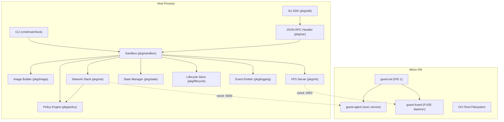

# Extensions and Architecture

This guide covers Matchlock's internal architecture, package responsibilities, extension points, and how to add new features. It is aimed at contributors who will modify the codebase.

## Architecture Overview

Matchlock boots ephemeral micro-VMs with a Linux kernel, runs guest processes inside them, and intercepts network traffic on the host to enforce security policies. The host and guest communicate over vsock.



### Data Flow

1. **CLI/SDK** parses user input, builds an `api.Config`, and calls `sandbox.New()`
2. **Sandbox** orchestrates image building, VM creation, network setup, and VFS setup
3. **Image builder** pulls OCI images, creates EROFS layer blobs, and returns layer paths
4. **VM backend** creates the micro-VM using Virtualization.framework (macOS) or Firecracker (Linux)
5. **guest-init** (PID 1) boots inside the VM, assembles overlay root from layer disks, configures networking, starts the FUSE daemon, then exec's the guest agent
6. **guest-agent** listens on vsock port 5000 for exec commands from the host
7. **guest-fused** mounts `/workspace` as a FUSE filesystem backed by the host VFS server over vsock port 5001
8. **Network stack** (when interception is active) intercepts all TCP traffic at L4, runs it through the policy engine plugin pipeline, and proxies allowed requests upstream

### Vsock Ports

| Port | Direction | Service |
|------|-----------|---------|
| 5000 | Host -> Guest | Exec service (command execution) |
| 5001 | Guest -> Host | VFS service (filesystem operations) |
| 5002 | Host -> Guest | Ready signal |

## Package Map

### Core Packages

| Package | Path | Responsibility |
|---------|------|---------------|
| `cmd/matchlock` | `cmd/matchlock/` | CLI entry point. Cobra commands for all subcommands. |
| `cmd/guest-init` | `cmd/guest-init/` | Unified in-VM runtime. Dispatches to init, agent, or fused mode based on `argv[0]`. |
| `pkg/sandbox` | `pkg/sandbox/` | Sandbox lifecycle: create, start, exec, close. Platform-specific files for Linux and macOS. |
| `pkg/api` | `pkg/api/` | Shared data types: `Config`, `NetworkConfig`, `ExecOptions`, `ExecResult`, `VFSConfig`, etc. |
| `pkg/vm` | `pkg/vm/` | VM backend interface (`Backend`, `Machine`, `InteractiveMachine`). Platform implementations in `vm/darwin/` and `vm/linux/`. |
| `pkg/image` | `pkg/image/` | OCI image pull, import, build. EROFS layer creation. Image metadata DB. |
| `pkg/policy` | `pkg/policy/` | Network policy plugin engine. Gate, Route, Request, Response plugin interfaces and built-in plugins. |
| `pkg/net` | `pkg/net/` | Network interception. gVisor userspace stack (macOS), nftables transparent proxy (Linux), TLS MITM, HTTP interceptor. |
| `pkg/vfs` | `pkg/vfs/` | Virtual filesystem. Provider interface, memory provider, real-fs provider, readonly wrapper, router, hook engine, CBOR-based VFS server. |
| `pkg/rpc` | `pkg/rpc/` | JSON-RPC handler for SDK communication over stdin/stdout. |
| `pkg/sdk` | `pkg/sdk/` | Go SDK: `SandboxBuilder` fluent API, `Client` for JSON-RPC. |
| `pkg/state` | `pkg/state/` | Host-side state management: VM directories, SQLite DB for VMs, subnets, lifecycle records. |
| `pkg/lifecycle` | `pkg/lifecycle/` | VM lifecycle state machine with phases and append-only records. |
| `pkg/logging` | `pkg/logging/` | Structured event logging: `Emitter`, `Event`, `Sink` interface, `JSONLWriter`. |
| `pkg/kernel` | `pkg/kernel/` | Kernel download and cache management. Kernel version pinned to `6.1.137`. |
| `pkg/storedb` | `pkg/storedb/` | SQLite DB helpers with WAL mode, migrations, and backup/restore. |
| `pkg/version` | `pkg/version/` | Version variables injected by ldflags at build time. |
| `pkg/vsock` | `pkg/vsock/` | Vsock connection helpers. |

### Internal Packages

| Package | Path | Responsibility |
|---------|------|---------------|
| `internal/errx` | `internal/errx/` | Sentinel error wrapping helpers. All packages use `errx.Wrap` and `errx.With` instead of `fmt.Errorf("%w", ...)`. |
| `internal/guestruntime/agent` | `internal/guestruntime/agent/` | Guest-side exec agent runtime. Handles command execution, PTY allocation, signal forwarding. |
| `internal/guestruntime/fused` | `internal/guestruntime/fused/` | Guest-side FUSE daemon runtime. Implements FUSE operations backed by host VFS over vsock. |

### SDK Packages (External)

| Package | Path | Published |
|---------|------|-----------|
| Python SDK | `sdk/python/` | [PyPI: matchlock](https://pypi.org/project/matchlock/) |
| TypeScript SDK | `sdk/typescript/` | [npm: matchlock-sdk](https://www.npmjs.com/package/matchlock-sdk) |

## Extension Points

### Adding a New Network Policy Plugin

This is the most common extension. The plugin system is designed for this.

**Files to modify:**

1. `pkg/policy/your_plugin.go` -- Create your plugin implementation
2. `pkg/policy/registry.go` -- Register the factory in `init()`
3. (Optional) `pkg/api/config.go` -- Add flat config field to `NetworkConfig`
4. (Optional) `pkg/policy/engine.go` -- Add flat-field compilation in `NewEngine()`
5. (Optional) `cmd/matchlock/cmd_run.go` -- Add CLI flag

**Step-by-step guide:** See [Network Plugins: Writing a New Plugin](network-plugins.md#writing-a-new-plugin) for the full walkthrough with code examples.

**Key interfaces to implement:**

```go
// pkg/policy/plugin.go

type Plugin interface {
    Name() string
}

type GatePlugin interface {
    Plugin
    Gate(host string) *GateVerdict
}

type RoutePlugin interface {
    Plugin
    Route(req *http.Request, host string) (*RouteDecision, error)
}

type RequestPlugin interface {
    Plugin
    TransformRequest(req *http.Request, host string) (*RequestDecision, error)
}

type ResponsePlugin interface {
    Plugin
    TransformResponse(resp *http.Response, req *http.Request, host string) (*ResponseDecision, error)
}
```

A single plugin can implement multiple interfaces. The engine auto-sorts your plugin into the correct phase slices based on which interfaces it satisfies.

**Convention:** Plugins log at `Debug` level only. The engine handles `Info` and `Warn` level logs for phase outcomes. Every plugin receives a pre-scoped `*slog.Logger` with `component=policy` and `plugin=<name>` already set.

### Adding a New CLI Command

**Files to create/modify:**

1. `cmd/matchlock/cmd_yourcommand.go` -- New cobra command
2. Register it in the `init()` function of that file via `rootCmd.AddCommand(yourCmd)`

**Pattern:** Follow any existing command file (e.g., `cmd_list.go` for simple commands, `cmd_run.go` for complex ones). Commands use:

- `spf13/cobra` for CLI parsing
- `spf13/viper` for environment variable binding
- `internal/errx` for error wrapping

### Adding a New VFS Provider

VFS providers implement the `vfs.Provider` interface:

```go
// pkg/vfs/provider.go

type Provider interface {
    Readonly() bool
    Stat(path string) (FileInfo, error)
    ReadDir(path string) ([]DirEntry, error)
    Open(path string, flags int, mode os.FileMode) (Handle, error)
    Create(path string, mode os.FileMode) (Handle, error)
    Mkdir(path string, mode os.FileMode) error
    Chmod(path string, mode os.FileMode) error
    Remove(path string) error
    RemoveAll(path string) error
    Rename(oldPath, newPath string) error
    Symlink(target, link string) error
    Readlink(path string) (string, error)
}
```

**Existing providers:**

| Provider | File | Description |
|----------|------|-------------|
| `MemoryProvider` | `pkg/vfs/memory.go` | In-memory filesystem. Used for overlay snapshot mounts and default workspace. |
| `RealFSProvider` | `pkg/vfs/realfs.go` | Pass-through to host filesystem. Used for `host_fs` mounts. |
| `ReadonlyProvider` | `pkg/vfs/readonly.go` | Wraps any provider to make it read-only. Used for `ro` mounts. |

The VFS router (`pkg/vfs/router.go`) dispatches operations to the correct provider based on path prefix.

**To add a new provider:**

1. Create `pkg/vfs/your_provider.go` implementing `Provider`
2. Add the mount type constant to `pkg/api/config.go`
3. Wire it in `pkg/sandbox/sandbox_common.go` in `buildVFSProviders()` or `createProvider()`

### Adding a New VM Backend

VM backends implement the `vm.Backend` and `vm.Machine` interfaces:

```go
// pkg/vm/backend.go

type Backend interface {
    Create(ctx context.Context, config *VMConfig) (Machine, error)
    Name() string
}

type Machine interface {
    Start(ctx context.Context) error
    Stop(ctx context.Context) error
    Wait(ctx context.Context) error
    Exec(ctx context.Context, command string, opts *api.ExecOptions) (*api.ExecResult, error)
    NetworkFD() (int, error)
    VsockFD() (int, error)
    PID() int
    Close(ctx context.Context) error
    RootfsPath() string
}
```

**Existing backends:**

| Backend | Path | Platform |
|---------|------|----------|
| `DarwinBackend` | `pkg/vm/darwin/` | macOS (Virtualization.framework) |
| `LinuxBackend` | `pkg/vm/linux/` | Linux (Firecracker) |

For interactive terminal support, also implement `vm.InteractiveMachine`.

Adding a new backend requires:

1. Implementing the interfaces in `pkg/vm/your_backend/`
2. Creating a platform-specific sandbox file `pkg/sandbox/sandbox_yourplatform.go` (using Go build tags)
3. Wiring the backend creation in the sandbox `New()` function

### Adding VFS Interception Hooks

VFS hooks intercept filesystem operations on mounted guest paths. They run on the host side.

**Host-side hooks** (in `pkg/vfs/hooks.go`):

```go
type HookRule struct {
    Phase           HookPhase
    Ops             []HookOp
    Path            string // filepath glob
    Action          HookAction
    MutateWriteFunc func(ctx context.Context, req MutateWriteRequest) ([]byte, error)
}
```

**SDK hooks** (in `pkg/sdk/`): The SDK provides a higher-level API with `action_hook`, `mutate_hook`, `hook`, and `dangerous_hook` callbacks. See [VFS Interception](vfs-interception.md).

### Adding Event Types

To add new event types to the structured logging system:

1. Define the event type constant and data struct in `pkg/logging/event.go`
2. Emit from the appropriate component using `emitter.Emit()`
3. Add golden test fixtures in `pkg/logging/testdata/`

**Convention:** Only the policy engine and HTTP interceptor emit events. Plugins return structured decision objects; the engine reads them and emits events. This is enforced at compile time by the plugin interface signatures.

## Key Design Decisions

### The VM IS the Sandbox

Matchlock uses `sandbox.mode: "off"` semantics -- the micro-VM itself provides isolation. There is no additional sandbox layer inside the guest. The guest has a full Linux environment where it can install packages, write files, and run arbitrary code. Isolation comes from the VM boundary.

### Secrets Never Enter the VM

Secret values exist only in the host process. The guest sees placeholder environment variables. The MITM proxy substitutes real values in HTTP headers only when:
- The request is going to a host in the secret's allowed host list
- The placeholder appears in the request

If a placeholder would be sent to an unauthorized host, the request is blocked entirely.

### Overlay Root Assembly

Since v0.1.23, Matchlock uses OCI layer-aware storage. Instead of creating monolithic rootfs images, it:

1. Stores each OCI layer as a separate EROFS blob
2. At VM boot, attaches N read-only layer disks plus one writable upper disk
3. guest-init assembles a kernel overlayfs root inside the VM using `pivot_root`

This eliminates duplicate data across images sharing layers and across concurrent VMs of the same image.

### Platform-Specific Network Interception

The interception path differs by platform:

- **macOS:** gVisor userspace TCP/IP stack operates at L4. The `pkg/net/stack_darwin.go` file creates a gVisor network stack connected to the VM via a socket pair. TCP connections are intercepted and handled by the HTTP interceptor.
- **Linux:** nftables DNAT rules redirect ports 80/443 to a transparent proxy. The proxy handles both HTTP and HTTPS (via TLS MITM). Implemented in `pkg/net/nftables.go` and `pkg/net/proxy.go`.

### Error Handling with errx

All packages use sentinel errors with `internal/errx` wrapping:

```go
// Define sentinels in errors.go per package
var ErrSomething = errors.New("something failed")

// Wrap with underlying error
return errx.Wrap(ErrSomething, err)

// Add context
return errx.With(ErrSomething, " for %s: %w", name, err)
```

Direct `fmt.Errorf("%w", ...)` is forbidden in packages (enforced by `mise run check:errx`). Use `errors.Is` at call sites.

## Testing

### Unit Tests

```bash
mise run test            # All unit tests
mise run test:coverage   # With coverage report
```

### Acceptance Tests

Acceptance tests require a working VM backend (KVM on Linux, Virtualization.framework on macOS):

```bash
mise run build                    # Build first
mise run test:acceptance          # Run acceptance suite
```

Acceptance tests use the `acceptance` build tag. They are in `tests/acceptance/` and cover:

- CLI operations (run, exec, build, image management)
- Network isolation and interception
- Port forwarding
- SDK operations (exec, files, VFS interception, cancellation)
- Image filesystem correctness
- User and entrypoint overrides
- Concurrent sandbox launches
- Storage regression (layer dedup, startup latency)

**Parallelism:** Controlled by `MATCHLOCK_ACCEPTANCE_PARALLEL` (default: 4).

**Binary path:** Tests use `MATCHLOCK_BIN` env var to find the matchlock binary.

> **Note:** macOS acceptance tests are known to be slightly flaky. A few sporadic failures are expected.

### Python SDK Tests

```bash
mise run python-sdk:test          # All Python versions (3.10, 3.11, 3.12)
mise run python-sdk:lint          # mypy + ruff
mise run check:python-sdk         # Both
```

### Linting and Checks

```bash
mise run fmt                      # Format code
mise run vet                      # go vet
mise run lint                     # golangci-lint
mise run check:errx               # Enforce errx usage
mise run check                    # All checks (Go + Python SDK)
```

## File Map for Common Changes

### "I want to add a new CLI flag to `matchlock run`"

1. `cmd/matchlock/cmd_run.go` -- Add the flag in `init()`, read it in `runRun()`
2. `pkg/api/config.go` -- Add the field to the appropriate config struct
3. Wire the value through `sandbox.New()` or the relevant subsystem

### "I want to change how images are stored or pulled"

- `pkg/image/` -- Image pull, extraction, EROFS creation, metadata DB
- `pkg/storedb/` -- SQLite helpers used by the image store

### "I want to modify guest boot behavior"

- `cmd/guest-init/main.go` -- PID 1 bootstrap: overlay root assembly, networking, hostname, DNS, disk mounting, fused startup, then exec to agent
- Kernel cmdline parameters are set by `pkg/vm/darwin/` or `pkg/vm/linux/` backends

### "I want to change how exec works"

- `internal/guestruntime/agent/` -- Guest-side exec agent (handles command execution, PTY, signals)
- `pkg/sandbox/sandbox_{darwin,linux}.go` -- Host-side `Exec()` that sends commands over vsock
- `pkg/sandbox/exec_relay.go` -- Exec relay for `matchlock exec` to connect to a running VM

### "I want to add a new VFS hook operation"

- `pkg/vfs/hooks.go` -- Host-side hook engine
- `pkg/vfs/interceptor.go` -- VFS interceptor that applies hooks
- `pkg/vfs/server.go` -- VFS CBOR server that communicates with guest fused
- `pkg/sandbox/vfs_hooks.go` -- SDK hook compilation

### "I want to change lifecycle state management"

- `pkg/lifecycle/` -- Phase state machine, append-only lifecycle records
- `pkg/state/` -- VM metadata, subnet allocations, SQLite state DB

### "I want to modify the network interception pipeline"

- `pkg/net/stack_darwin.go` -- macOS gVisor userspace stack
- `pkg/net/proxy.go` -- Linux transparent proxy
- `pkg/net/http.go` -- HTTP interceptor (shared by both platforms)
- `pkg/net/tls.go` -- TLS MITM
- `pkg/policy/engine.go` -- Plugin orchestration

### "I want to add structured log events"

- `pkg/logging/event.go` -- Event type constants and data structs
- `pkg/logging/emitter.go` -- Emitter that stamps metadata and dispatches to sinks
- `pkg/logging/jsonl_writer.go` -- JSONL file writer sink

## Architecture Decision Records

Design decisions are documented in the `adrs/` directory:

| ADR | Title |
|-----|-------|
| `adrs/001-local-image-build.md` | Local image build with BuildKit-in-VM |
| `adrs/002-vfs-interception.md` | VFS interception design |
| `adrs/003-oci-layer-store-overlay-root.md` | OCI layer-aware storage and overlay root assembly |

## CI/CD

GitHub Actions workflows in `.github/workflows/`:

| Workflow | Trigger | Purpose |
|----------|---------|---------|
| `ci.yml` | Push/PR | Go tests, lint, Python SDK tests |
| `release.yml` | Tag push (`v*`) | Cross-compile, create GitHub release with binaries |
| `kernel.yml` | Manual | Build and publish kernel images to GHCR |
| `python-sdk.yml` | Push/PR | Python SDK tests across Python versions |
| `python-sdk-release.yml` | Tag push | Publish Python SDK to PyPI |
| `typescript-sdk.yml` | Push/PR | TypeScript SDK tests |
| `typescript-sdk-release.yml` | Tag push | Publish TypeScript SDK to npm |

### Release Process

```bash
# 1. Update VERSION.txt
# 2. Create and push tag
mise run push-tag

# GitHub Actions automatically creates the release with cross-compiled binaries.
```

Or manually:

```bash
mise run release
```
