# Agent Client Protocol (ACP) Example

A Streamlit chatbot that runs an AI coding agent ([kodelet](https://github.com/jingkaihe/kodelet)) inside a [matchlock](https://github.com/jingkaihe/matchlock) micro-VM sandbox, communicating over the [Agent Client Protocol](https://agentclientprotocol.com/get-started/introduction).

## Architecture

```mermaid
flowchart TD
    Browser["🌐 Browser"]

    subgraph Host ["Host Machine"]
        direction TB
        subgraph Streamlit ["Streamlit App · main.py"]
            UI["Chat UI"]
            ACP_Client["ACP Client"]
        end
        subgraph Matchlock ["matchlock run -i"]
            MITM["MITM Proxy"]
        end
    end

    subgraph VM ["Matchlock Micro-VM · Ubuntu 24.04"]
        Kodelet["kodelet acp"]
    end

    Cloud["☁️ LLM API"]

    Browser -- HTTP --> UI
    UI --> ACP_Client
    ACP_Client -- stdin/stdout --> Matchlock
    Matchlock -- vsock --> Kodelet
    Kodelet -- HTTPS --> MITM
    MITM -- "HTTPS + real API key" --> Cloud
```



### How it works

1. `main.py` spawns `matchlock run --image acp:latest -i --` as a subprocess, which boots a micro-VM and pipes stdin/stdout to the guest process.
2. The ACP client speaks the Agent Client Protocol over that stdio pipe — sending prompts and receiving streamed thoughts, tool calls, and messages.
3. Inside the VM, `kodelet acp` (installed via the Dockerfile) acts as the AI agent, calling the Anthropic API to reason and execute code.
4. The MITM proxy transparently intercepts outbound HTTPS from the VM, injecting the real `ANTHROPIC_API_KEY` (passed via `--secret`) and enforcing the host allowlist (`--allow-host`).

## Prerequisites

- `matchlock` binary built and available (see `mise run build` in the repo root)
- `ANTHROPIC_API_KEY` environment variable set
- [uv](https://docs.astral.sh/uv/) installed (for running the Streamlit app)

## Quick Start

### 1. Build the sandbox image

Using Docker (faster):

```bash
docker build -t acp:latest examples/agent-client-protocol
docker save acp:latest | matchlock image import acp:latest
```

Using matchlock (no Docker required):

```bash
matchlock build -t acp:latest examples/agent-client-protocol
```

> Tip: Add `--build-cache-size 30000` if you plan to rebuild frequently, to avoid running out of device space in the build VM.

### 2. Run the app

```bash
export ANTHROPIC_API_KEY=sk-ant-...
uv run examples/agent-client-protocol/main.py
```

This opens a Streamlit chat UI in your browser. The first message boots the sandbox (takes a few seconds), then subsequent messages reuse the same VM session.

## Bonus: Interactive TUI Mode

You can also chat with the sandboxed agent directly from your terminal using [toad](https://github.com/jingkaihe/toad), without the Streamlit app:

```bash
toad acp 'matchlock run --image acp:latest --secret ANTHROPIC_API_KEY@api.anthropic.com --allow-host "*" -i --'
```



```mermaid
flowchart TD
    Terminal["🖥️ Terminal"]

    subgraph Host ["Host Machine"]
        direction TB
        Toad["toad acp · TUI"]
        subgraph Matchlock ["matchlock run -i"]
            MITM["MITM Proxy"]
        end
    end

    subgraph VM ["Matchlock Micro-VM · Ubuntu 24.04"]
        Kodelet["kodelet acp"]
    end

    Cloud["☁️ LLM API"]

    Terminal --> Toad
    Toad -- stdin/stdout --> Matchlock
    Matchlock -- vsock --> Kodelet
    Kodelet -- HTTPS --> MITM
    MITM -- "HTTPS + real API key" --> Cloud
```

Architecturally identical to the Streamlit example — `toad acp` runs on the host, spawns the matchlock subprocess, and speaks ACP over its stdin/stdout. The difference is you get a terminal TUI instead of a web UI.
